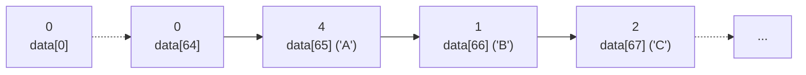

## 문제
- [2단계] [BOJ 1157](https://www.acmicpc.net/problem/1157): 단어 공부
- 시간 제한: 2초
- 메모리 제한: 128 MB

## 아이디어
1. 입력되는 문자열의 각 문자는 `A~Z`, `a~z`로 한정되어 있다.
2. 각 문자는 정수형으로 변환가능하다. e.g. 'A' → 65, 'a' → 97
3. 문자의 빈도수를 확인해야 한다. 입력되는 문자의 범위가 제한되어 있으므로 Counting sort에서 사용한 빈도수 확인 방법을 사용할 수 있을 것이다. ($O(n)$ 시간 소요)
4. 소문자를 대문자로 취급해야 한다. 소문자에서 32를 빼면 대문자가 된다. (ASCII 참고)

## 코드 설명
### 빈도수 저장
빈도수는 `data` 배열에 저장한다. `data[0]`부터 `data[64]`까지의 공간은 0으로 냅두고, `data[65]`부터 'A' 문자의 빈도수에 대응한다. 예를 들어서 "AAABCCA"라는 문자열이 있으면 `data`는 아래와 같은 값을 가질 것이다.

`data[0]`~`data[64]`가 그냥 빈 공간이여서 메모리적으로 비효율일 수 있다. 낭비되는 공간을 없앨려면 `data[0]`을 'A', `data[1]`을 'B', ...로 대응시키면 된다.
이렇게 하기에는 코드가 더 더러워지므로 그냥 이정도의 비효율은 감수하자. 어자피 문제에서 주어지는 메모리 제한은 넉넉해서 상관없다.

### 최대 빈도 확인
`data` 길이 만큼의 반복을 2회 한다. 첫 번째 반복은 최대 빈도수가 몇인지를 찾아서 `highest`에 저장하고, 두 번째 반복에서 `highest`만큼의 빈도가 등장하는 문자(`highest_char`)와 횟수(`count`)를 구한다.
`count`가 1이면 해당 문자를 출력하고, 2 이상이면 `?`를 출력한다.


## 성능 평가
시간복잡도는 $O(n)$이다. 여기서 $n$은 입력 문자열의 길이다. $1 ≤ n ≤ 1,000,000$.

## 전체 코드
```c
#include <stdio.h>

int main()
{
    int data[91] = {0}; // 빈도수를 저장할 배열. data[0]~data[64]는 그냥 빈 공간이다.
    char str[1000001]; // 입력 문자열을 저장할 배열.
    scanf("%s", str);

    // data에 빈도수 저장
    for (int i = 0; i < 1000001; i++)
    {
        if (str[i] == '\0')
            break;
        
        int current = str[i];
        if (str[i] > 95)
            current -= 32;

        data[current]++;
    }

    // 가장 많이 나온 값 확인
    int highest = 0;
    for (int i = 0; i <= 90; i++)
    {
        if (data[i] > highest)
            highest = data[i];
    }

    // 가장 많이 나온 문자가 몇 개인지 확인
    int count = 0;
    char highest_char = '\0';
    for (int i = 0; i <= 90; i++)
    {
        if (data[i] == highest)
        {
            count++;
            highest_char = i;
        }
    }

    // 출력
    if (count == 1)
        printf("%c", highest_char);
    else
        printf("?");
    
    return 0;
}
```

## 추가: 딕셔너리 활용
Python 같은 언어에서는 딕셔너리를 활용하면 더 깔끔하게 풀 수 있다. 문자를 key에, 빈도수를 value에 각각 대응시키면 된다.
```py
a = input()
data = {}
for i in a:
    try:
        data[i.upper()] += 1
    except:
        data[i.upper()] = 1

max_value = max(data.values())
max_char = [(k, v) for k, v in data.items() if v == max_value]
if len(max_char) == 1:
    print(max_char[0][0])
else:
    print("?")
```
